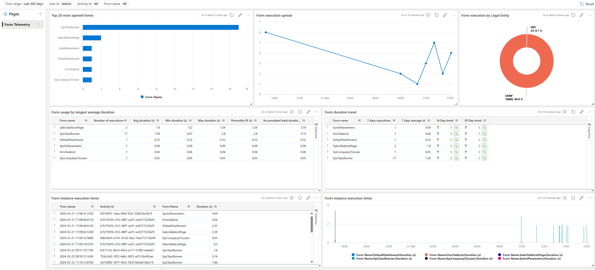

# Forms usage dashboard
This dashboard shows information about form usage in Dynacmis 365 Finance and SCM. Using this dashboard, it is possible to:
- Investigate the most used forms in the environment with the ability to filter on a specific user, form name or activity id.
- Review the opening times of the forms and find out what forms are slowest.
- Review trends of the curent form loading times over the last 14 / 30 days.
- Review individual opening times based on specific activities. 

## Dashboard overview
Note: the "Interaction difference" column can be used to identify forms that never complete the initialization. 

## Steps to import the sample dashboard:
  1. Import the file "ADE-Dashboard-D365FO-Monitoring-Forms.json".
  
  

  2. Name the dashboard appropriately.
  
   

  
  3. Click to select datasources. 
  
  

  
  4. There is a templated datasource with dummy placeholders. You need to replace with your Azure subscription, resource group and Application Insights instance.
  
  

  

