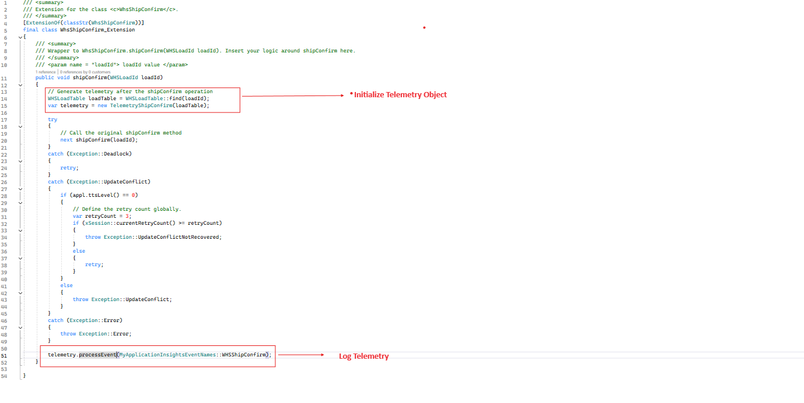

# Dynamics 365 FastTrack FSCM Telemetry Samples - TelemetryExtensionExample

This folder contains sample code and guidelines for implementing telemetry in Dynamics 365 Finance and Supply Chain Management (FSCM). The samples are intended to help customers utilize telemetry to monitor and optimize their D365 applications. The code is provided As-is to customer usage. No gaurentees are provided

## Table of Contents

- [Introduction](#introduction)
- [Prerequisites](#prerequisites)
- [Installation](#installation)
- [Usage](#usage)
- [Contributing](#contributing)
- [License](#license)

## Introduction

This project provides sample implementations of telemetry in D365 FSCM. It includes creation of a telemetry Base class to demonstrate how to utilize SysApplicationInsightsTelemetryLogger to log Events/metrics/traces with properties to ApplicationInsights. It also includes an extension to the MonitoringAndTelemetry module to control the granularity of logging to Application Insights.

## Prerequisites

- Dynamics 365 Finance and Supply Chain Management environment
- Visual Studio 2019 or later
- .NET Framework 4.7.2 or later
- Access to Azure Application Insights

## Installation

1. Clone the repository:

    ```bash
    git clone https://github.com/microsoft/Dynamics-365-FastTrack-FSCM-Telemetry-Samples.git
    cd Dynamics-365-FastTrack-FSCM-Telemetry-Samples\SampleXppExtensions\Projects\FastTrackFscmTelemetrySamples
    ```

2. Open the solution in Visual Studio in adminstrator mode and open FastTrackFscmTelemetrySamples.sln:

    Create the classes, enums, tables for the code under "\TelemetryExtensionExample\bin"
    The project structure will look like 
     

3. Once you create all the dependencies of the project, build the project and refresh AOT


if all the classes are built fine, you should see the Cost control configuration ('My Telemetry Log Settings' feel free to rename it as appropriate in your project)in Monitoring and Telemetry settings in your D365 F&O


## Usage

1. `MyTelemetryBase` class is the base class which provides structured access to SysApplicationInsightsTelemetryLogger. In this class you can aggregare Properties as your product code is executing and call the ProcessEvent, ProcessTrace, ProcessException etc methods at appropriate points to send those events to ApplicationInsights

    

2. For each different event/metric/Trace you want to log to AppInsights create a concrete class extending from MyTelemetryBase. Here's an example


3. Use the telemetry class to log telemetry.
 

4. Monitor the telemetry data in Azure Application Insights. Depending on whether you have logged an event, trace or exception etc, your data will be available in that respective table

    

## Contributing

We welcome contributions to this project. To contribute:

1. Fork the repository.
2. Create a new branch for your feature or bugfix.
3. Make your changes and commit them.
4. Push your changes to your fork.
5. Open a pull request to the main repository.

## License

This project is licensed under the MIT License. See the [LICENSE](LICENSE) file for more details.

